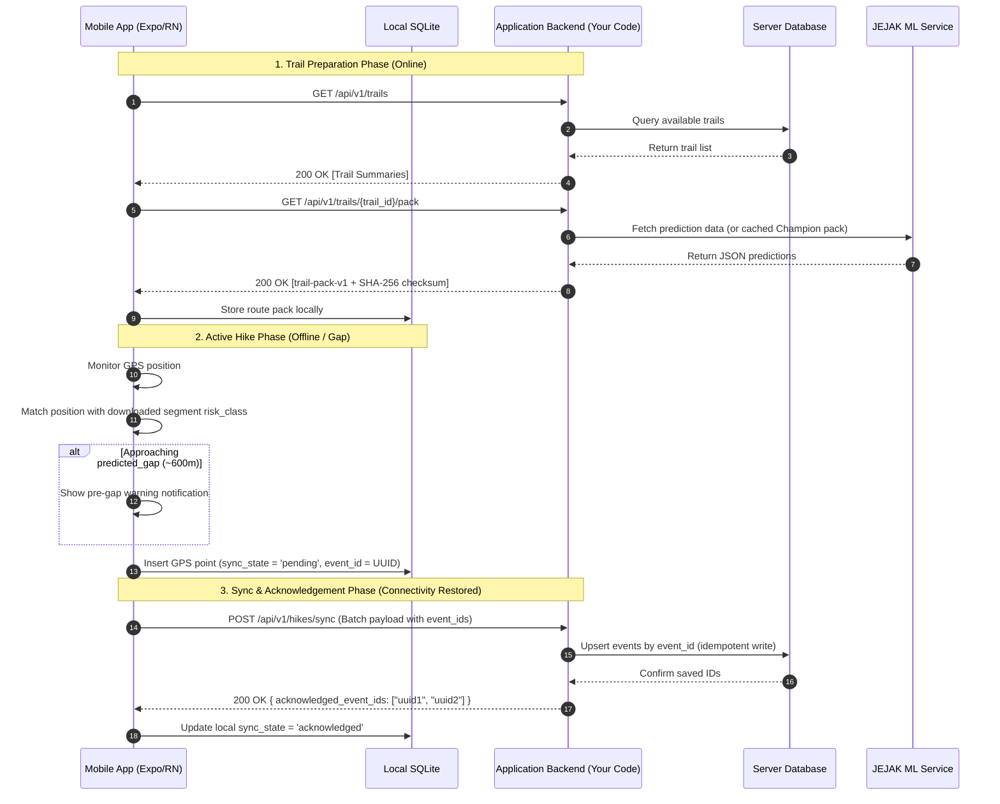

# JEJAK Backend Developer Onboarding & System Blueprint

> **Project Name:** JEJAK (HikerGuard GeoAI Mobile System)  
> **Role:** Backend Developer  
> **Source Documents Analyzed:** `mobile_plan_handoff_contract.md`, `ARCHITECTURE.md`, `JEJAK_MVP_IDEA_2.md`, `CONNECTIVITY_MVP_IMPLEMENTATION_TRACKER.md`  
> **Date:** August 2026

---

## 1. Overall Project

### What is Jejak?
**Jejak** (working title in mobile repo: *HikerGuard*) is a **phone-only GeoAI decision-support application** designed to enhance hiking safety. It predicts cellular connectivity gaps along hiking trails **before** hikers enter them, allowing hikers and park authorities to prepare for dead zones without requiring expensive external hardware (such as satellite phones or LoRa trackers).

### What Does the App Do?
1. **Pre-Hike Trail Download:** Hikers download a versioned offline "trail pack" containing trail geometry (ordered 250m segments) and cellular risk predictions.
2. **Pre-Gap Advance Warning:** As the hiker moves along the trail, the app monitors their GPS position. When approaching a predicted connectivity gap (~600m before), it triggers an alert recommending actions (e.g., share current location, download offline map, check battery).
3. **Offline GPS Trajectory Logging:** Inside cellular dead zones, the phone continuously records GPS coordinates, timestamps, and battery levels locally.
4. **Idempotent Batch Synchronisation:** When the phone re-establishes internet connectivity (or when the hike finishes), queued GPS records and events are uploaded to the backend in batches.
5. **Last Synced Location Tracking:** The system maintains the last *server-acknowledged* GPS coordinate, enabling emergency contacts or authorities to know a hiker's last confirmed location if they fail to return on time.

### Main System Components
The overall system is divided into **3 distinct tiers**:

```
 ┌─────────────────────────────────────────────────────────────┐
 │                     Mobile Application                      │
 │                 (HikerGuard-GeoAI-Mobile)                   │
 │   - Expo / React Native (iOS & Android)                     │
 │   - Local SQLite database & offline queue                   │
 └──────────────────────────────┬──────────────────────────────┘
                                │ REST / JSON APIs
                                ▼
 ┌─────────────────────────────────────────────────────────────┐
 │                     Application Backend                     │
 │                  (YOUR RESPONSIBILITY!)                     │
 │   - User Auth, Trip Plans, Trail Pack Delivery             │
 │   - Idempotent Batch Sync & Location Acknowledgement       │
 │   - Relational Database (PostgreSQL / MySQL / SQLite)       │
 └──────────────────────────────┬──────────────────────────────┘
                                │ Internal HTTP Contract
                                ▼
 ┌─────────────────────────────────────────────────────────────┐
 │                    JEJAK ML Prediction API                  │
 │                  (Separate AI Microservice)                 │
 │   - Python / FastAPI + scikit-learn                         │
 │   - GeoAI Feature Engineering & Model Registry              │
 └─────────────────────────────────────────────────────────────┘
```

### How Mobile Communicates with Backend
* **Protocol:** Standard HTTPS / REST using JSON payloads.
* **Authentication:** Bearer tokens / JWT (to be specified by backend).
* **Data Interchange:**
  * Downloads trail packs with SHA-256 integrity checksums.
  * Sends location batches with client-side UUIDs (`event_id`) for **idempotency**.
  * Receives server acknowledgements containing list of explicitly accepted `acknowledged_event_ids`.

---

## 2. System Architecture & Component Interaction



### Component Roles Explained:
1. **Mobile App:** Client UI, GPS collector, offline storage engine, proximity warning evaluator. Never runs ML models directly.
2. **Application Backend (Your Domain):** Single point of entry for mobile app. Handles authentication, stores user sessions and trail metadata, validates upload batches, ensures idempotent deduplication, and serves trail packs.
3. **Database (Server):** Stores persistent user records, hike sessions, synced GPS locations, emergency contacts, and cached trail packs.
4. **JEJAK ML Service:** Specialized backend microservice that processes geospatial rasters (Copernicus DEM, ESA WorldCover, OpenCellID, Ookla) to produce transfer-learning predictions (`likely_covered`, `uncertain`, `predicted_gap`).

---

## 3. Backend Specification & Architecture Blueprint

Since the application backend repository needs to be created, here is the recommended architecture and module design.

### Recommended Stack
* **Language & Runtime:** Node.js (TypeScript) or Python (FastAPI). *TypeScript/Express or NestJS is standard for mobile-facing REST APIs.*
* **Database:** PostgreSQL (with PostGIS extension recommended for geospatial queries) or MySQL / SQLite for MVP.
* **ORM / Query Builder:** Prisma, Drizzle, or TypeORM (Node.js) / SQLAlchemy (Python).
* **Validation:** Zod (Node.js) or Pydantic (Python).

### Proposed Folder Structure
```text
backend/
├── src/
│   ├── config/             # Environment variables & constants
│   ├── controllers/        # HTTP Request handlers
│   ├── services/           # Business logic & domain workflows
│   ├── models/             # Database schemas & ORM entities
│   ├── routes/             # API route definitions
│   ├── middlewares/        # Auth, error handling, rate limiting, validation
│   ├── utils/              # Checksum (SHA-256), helpers, logger
│   └── app.ts / server.ts  # Application entry point
├── tests/                  # Integration & unit tests
├── prisma/ or migrations/  # DB schema migrations
├── .env.example            # Environment template
└── package.json
```

### Key Modules & Responsibilities

| Component | File / Path | Responsibility |
| --- | --- | --- |
| **Entry Point** | `src/app.ts` | Server initialization, Express/FastAPI app setup, middleware mounting. |
| **Config** | `src/config/env.ts` | Loads `.env` (PORT, DATABASE_URL, JWT_SECRET, ML_SERVICE_URL). |
| **Auth Middleware** | `src/middlewares/auth.middleware.ts` | Validates JWT bearer tokens, attaches `userId` to request context. |
| **Trail Controller** | `src/controllers/trail.controller.ts` | Handles `GET /trails` and `GET /trails/:id/pack`. |
| **Trail Service** | `src/services/trail.service.ts` | Reads trail packs, calculates SHA-256 checksums, formats `trail-pack-v1`. |
| **Sync Controller** | `src/controllers/sync.controller.ts` | Handles `POST /hikes/sync` for batch location uploads. |
| **Sync Service** | `src/services/sync.service.ts` | **Idempotent processing logic:** Upserts location points by client `event_id`, returns array of acknowledged IDs. |
| **Database Schema** | `prisma/schema.prisma` | DB model definitions for Users, Hikes, Locations, Trails. |

---

## 4. How the Data Flows

### Flow 1: Trail Pack Download (`Mobile → Backend → DB/Filesystem → Mobile`)
1. **Mobile Request:** `GET /api/v1/trails/trail_jalan_kledang/pack`
2. **Backend Auth/Route:** Route passes to `TrailController.getTrailPack`.
3. **Backend Service:** `TrailService` fetches JSON trail pack from database or local file store.
4. **Integrity Verification:** Backend computes canonical SHA-256 checksum of payload (excluding checksum key itself).
5. **Response:** Returns `trail-pack-v1` compliant JSON object with status `200 OK`.
6. **Mobile Processing:** Mobile validates JSON structure against Zod schema, verifies SHA-256 checksum, saves pack to local SQLite `route_pack` table.

### Flow 2: Idempotent Batch Location Sync (`Mobile → Queue → Backend → DB → Ack`)
1. **Mobile Queue:** Mobile app accumulates offline points in local SQLite `location_point` table with `sync_state = 'pending'`.
2. **Trigger:** Phone reconnects to Wi-Fi/4G or user foregrounds app.
3. **Payload Construction:** Mobile batches up to N pending points into payload:
   ```json
   {
     "device_id": "phone-install-id-12345",
     "local_session_id": "550e8400-e29b-41d4-a716-446655440000",
     "events": [
       {
         "event_id": "a1b2c3d4-0001-4000-8000-000000000001",
         "type": "location_point",
         "recorded_at": "2026-08-07T10:15:30Z",
         "payload": {
           "latitude": 4.5892,
           "longitude": 101.0621,
           "horizontal_accuracy_m": 5.2,
           "battery_level": 0.85,
           "segment_id": "trail_jalan_kledang__s00005"
         }
       }
     ]
   }
   ```
4. **Backend Ingestion:** `POST /api/v1/hikes/sync`
   * `SyncService` starts database transaction.
   * For each event in array, it performs an **upsert** (`ON CONFLICT (event_id) DO NOTHING` or `UPDATE`).
   * If save succeeds or record already existed, `event_id` is pushed to `acknowledged_event_ids`.
5. **Backend Response:**
   ```json
   {
     "server_session_id": "server-session-uuid-9999",
     "acknowledged_event_ids": ["a1b2c3d4-0001-4000-8000-000000000001"],
     "rejected_events": [],
     "server_received_at": "2026-08-07T10:15:35Z"
   }
   ```
6. **Mobile Mark:** Mobile updates local SQLite `location_point` rows matching `acknowledged_event_ids` to `sync_state = 'acknowledged'`.

---

## 5. Mobile Handoff Contract Analysis & Gap Matrix

`mobile_plan_handoff_contract.md` establishes strict expectations for the backend. Below is the implementation audit comparing the handoff contract against the current repository state:

### Implementation Status Matrix

| Component / Requirement | Status | Current Code Base State & Details |
| --- | --- | --- |
| **Mobile App (HikerGuard UI/Local SQLite)** | 🟡 Partial | Mobile foundation, SQLite migrations, Zod contracts, and mock repositories (`FixtureTrailRepository`) exist. Runs on Expo SDK 54. |
| **JEJAK ML Service (GeoAI Python)** | 🟡 Partial | Milestones 0-5 complete (datasets, 250m trail segmentation, OpenCellID & Ookla evidence normalized). ML Model Candidates pending (Milestone 8). |
| **Application Backend API** | ❌ **Not Implemented (0%)** | **No application backend server exists yet.** Currently, the mobile app connects to client-side fixture mocks. |
| **`trail-pack-v1` Delivery Endpoint** | ❌ Not Implemented | Needs `GET /api/v1/trails` and `GET /api/v1/trails/:id/pack` with SHA-256 checksum integrity. |
| **Idempotent Batch Sync Endpoint** | ❌ Not Implemented | Needs `POST /api/v1/hikes/sync` supporting unique `event_id` deduplication. |
| **User Auth & Emergency Contacts** | ❌ Not Implemented | Needs signup/login endpoints and emergency contact management. |
| **SOS Acknowledgement Protocol** | ⚠️ Unclear / Deferred | Defined as P1. Requires backend escalation policy and acknowledgment contract before mobile release. |

### Crucial Product & Technical Constraints
1. **Terminology Compliance (STRICT):**
   * Backend API responses and metadata MUST use exact risk classes: `likely_covered`, `uncertain`, `predicted_gap`.
   * **NEVER** return or phrase descriptions as "confirmed dead zone", "guaranteed coverage", or "no signal".
2. **Schema Discrimination (`trail-pack-v1`):**
   * Backend must discriminate between `route_only` (unscored GPX tracks), `fixture` (development data), and `Candidate`/`Champion` (model-backed).
   * Unscored GPX tracks MUST return `prediction_available: false`, `risk_class: "uncertain"`, and `warning_eligible: false`.
3. **Idempotency Guarantee:**
   * Mobile apps on spotty connections will re-send sync batches multiple times. The backend **MUST** use `event_id` (client UUID) as the unique primary key in `location_points` and `hike_events` tables to prevent duplicate records.

---

## 6. Backend Developer Action Plan (Prioritized Tasks)

To bring the project from 0% backend to full MVP integration, follow this prioritized roadmap:

### Phase 1: Critical (P0) — Essential MVP Features
> **Goal:** Enable Mobile App to download real trail packs and perform real batch sync.

#### Task 1.1: Initialize Application Backend Repository
* **What:** Create a new Node.js (Express + TypeScript + Prisma) or Python (FastAPI) project.
* **Why:** Standardized foundation for API routes, database access, and CORS middleware.
* **Files:** `package.json`, `tsconfig.json`, `src/server.ts`, `.env`.
* **Verification:** Run `npm run dev`, verify `GET /health` returns `{ status: "ok" }`.

#### Task 1.2: Database Migration & Schema Design
* **What:** Set up database (PostgreSQL/MySQL/SQLite) and execute migrations for core tables:
  * `users` (id, email, password_hash, created_at)
  * `trails` (id, name, distance_m, gpx_path)
  * `trail_packs` (id, trail_id, pack_version, schema_version, json_data, checksum)
  * `hike_sessions` (id, local_session_id, user_id, trail_id, status, started_at)
  * `location_points` (event_id UNIQUE PK, local_session_id, recorded_at, lat, lon, accuracy, segment_id, battery_level)
  * `hike_events` (event_id UNIQUE PK, type, payload_json)
* **Why:** Persist mobile data and trail packs cleanly.
* **Verification:** Run migration script and inspect DB schema via DB GUI (TablePlus/pgAdmin).

#### Task 1.3: Trail List & `trail-pack-v1` Endpoints
* **What:** Implement `GET /api/v1/trails` and `GET /api/v1/trails/:trailId/pack`.
* **Why:** Mobile app WP2 (`HttpTrailRepository`) requires HTTP trail pack downloads.
* **Verification:** Seed the database with the 4 GPX trails (`trail_jalan_kledang`, etc.). Fetch via Postman/cURL and verify SHA-256 checksum matches payload body.

#### Task 1.4: Idempotent Batch Sync Endpoint
* **What:** Implement `POST /api/v1/hikes/sync`.
* **Why:** Mobile app WP5 (`SyncWorker`) requires server batch acknowledgement.
* **Logic:** Receive array of events, perform `INSERT ... ON CONFLICT (event_id) DO NOTHING`, return array of `acknowledged_event_ids`.
* **Verification:** Send a mock POST request with 5 event IDs twice; ensure server returns all 5 acknowledged IDs both times without creating duplicate DB rows.

---

### Phase 2: Important (P1) — Security & User Management
* **Task 2.1: User Auth (JWT):** Implement `POST /api/v1/auth/register` and `POST /api/v1/auth/login`. Protect `/hikes/*` routes with JWT middleware.
* **Task 2.2: Trip Plans & Emergency Contacts:** Implement endpoints to save expected return time and contact phone numbers for a hike.
* **Task 2.3: Proxy / Bridge to JEJAK ML API:** Create a background job or endpoint to pull predictions from the Python ML service and package them into `trail-pack-v1` format.

---

### Phase 3: Nice to Have (P2) — Emergency & Safety Enhancements
* **Task 3.1: SOS Acknowledgement Pipeline:** Handle emergency signal ingestion and return explicit acknowledgement tokens.
* **Task 3.2: Authority Planning Dashboard API:** Expose endpoints for park rangers to view aggregated gap predictions and historical trail sync points.

---

## 7. Learning Path: Where Should I Start?

If you just joined the team today, read the codebase documents in this exact order:

```text
 1. JEJAK_MVP_IDEA_2.md
    └── Understand WHY Jejak exists, user personas, risk classes, and GeoAI vision.

 2. ARCHITECTURE.md
    └── Understand system boundaries (Mobile vs Application Backend vs ML Service).

 3. mobile_plan_handoff_contract.md
    └── Deep-dive into Section 4, 8, 9, 11, 12! This defines EXACTLY what the mobile app expects from YOUR backend.

 4. CONNECTIVITY_MVP_IMPLEMENTATION_TRACKER.md
    └── Reference for data models, score semantics (`risk_score` vs `confidence`), and ML milestones.
```

---

## 8. Final Summary & Action Checklist

### Simplest Explanation of Jejak
Jejak is an offline-first hiking safety system. The mobile app downloads trail map packs with AI predictions of cellular coverage gaps. During the hike, the app warns hikers before they hit dead zones, logs GPS coordinates offline while in dead zones, and syncs all recorded coordinates back to **your Application Backend** as soon as signal is restored.

### Top 4 Database Tables to Build First
1. **`trails` / `trail_packs`**: Stores pre-computed GeoJSON/JSON trail packs + SHA-256 checksums.
2. **`hike_sessions`**: Maps client `local_session_id` (UUID) to `server_session_id`.
3. **`location_points`**: Stores synced GPS points (Primary Key = client `event_id`).
4. **`users`**: User identity & authentication.

### First 4 Actions for Day 1
1. **Setup Backend Project:** Initialize a Node.js/TypeScript (or Python/FastAPI) repository with Express, Prisma/SQLAlchemy, and Zod.
2. **Create Core Database Migration:** Apply schemas for `users`, `trails`, `trail_packs`, `hike_sessions`, `location_points`.
3. **Build Trail Pack API:** Implement `GET /api/v1/trails/:id/pack` using the contract schema defined in Section 8 of `mobile_plan_handoff_contract.md`.
4. **Build Batch Sync API:** Implement `POST /api/v1/hikes/sync` with idempotent `event_id` upserts.

### Key Questions to Ask Your Team / Team Lead
1. **Tech Stack Preference:** *"Do we prefer Node.js (TypeScript/Express/Prisma) or Python (FastAPI) for the Application Backend?"*
2. **Base URL & Deployment:** *"Where will the application backend be hosted during development/staging (e.g. Render, Railway, AWS, local network IP for mobile testing)?"*
3. **User Auth Requirement:** *"Should we allow guest hikes (anonymous device IDs) to sync location points before creating a full user account?"*
4. **JEJAK ML Service Connection:** *"When will the JEJAK Python ML service export production Champion predictions, and should the backend fetch them via HTTP REST or read exported JSON files?"*
